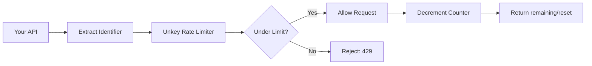
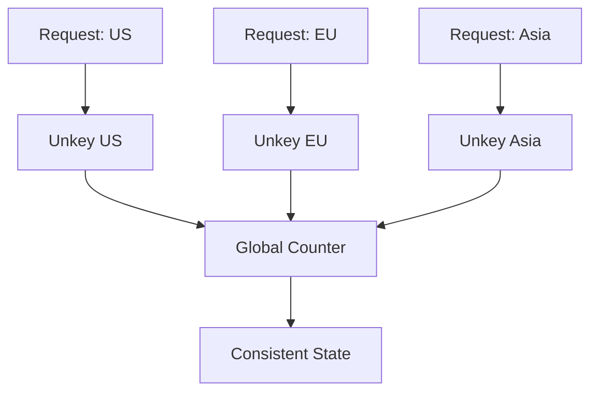

Rate limiting controls how many requests a user, API key, IP address, or any identifier can make within a given time window. Unkey provides globally distributed rate limiting that works at the edge without you managing any infrastructure.

## Why Rate Limiting?

<CardGroup cols={2}>
  <Card title="Prevent abuse" icon="shield">
    Stop bad actors from hammering your endpoints, scraping data, or launching DDoS attacks
  </Card>
  <Card title="Protect infrastructure costs" icon="piggy-bank">
    Limit expensive operations (AI calls, database queries) before they blow up your bill
  </Card>
  <Card title="Fair usage enforcement" icon="scale-balanced">
    Ensure no single user monopolizes shared resources or degrades service for others
  </Card>
  <Card title="Compliance & SLAs" icon="file-contract">
    Enforce contractual limits ("10,000 requests/month on Basic plan")
  </Card>
</CardGroup>

## How It Works

Unkey's rate limiting uses a sliding window algorithm for smooth, accurate enforcement:



<Steps>
  <Step title="Choose an identifier">
    Decide what you're limiting: user ID, API key, IP address, organization ID, or any string that uniquely identifies the requester.
  </Step>
  <Step title="Set the limit">
    Define how many requests are allowed and over what duration. Example: 100 requests per minute.
  </Step>
  <Step title="Check on each request">
    Call `limiter.limit(identifier)` and Unkey tells you whether to allow or reject the request.
  </Step>
</Steps>

## Rate Limiting Approaches

Unkey offers two complementary ways to implement rate limiting:

| Approach | Best For | How It Works |
|----------|----------|---------------|
| **Standalone** | Any endpoint, public or private | You call `limiter.limit()` with any identifier — works with or without API keys |
| **Key-attached** | API key authenticated endpoints | Rate limits are configured per-key and automatically enforced during `keys.verify()` |

<Tip>
Use both! Apply standalone rate limiting to public endpoints (login, signup) and key-attached limits to authenticated API calls.
</Tip>

## Standalone Rate Limiting

Protect any endpoint with identifier-based rate limiting.

<Tabs>
  <Tab title="TypeScript">
    ```typescript
    import { Ratelimit } from "@unkey/ratelimit";

    const limiter = new Ratelimit({
      rootKey: process.env.UNKEY_ROOT_KEY,
      namespace: "api",      // Group related limits
      limit: 10,             // 10 requests...
      duration: "60s",       // ...per minute
    });

    export async function handler(req: Request) {
      // Use any identifier: user ID, IP, session, etc.
      const identifier = req.headers.get("x-user-id") ?? getClientIP(req);
      
      const { success, remaining, reset } = await limiter.limit(identifier);
      
      if (!success) {
        return new Response("Too many requests", {
          status: 429,
          headers: {
            "X-RateLimit-Remaining": "0",
            "X-RateLimit-Reset": reset.toString(),
            "Retry-After": Math.ceil((reset - Date.now()) / 1000).toString()
          }
        });
      }
      
      // Request allowed — continue
      return new Response(`Success! ${remaining} requests remaining.`);
    }
    ```
  </Tab>
  <Tab title="Next.js Middleware">
    ```typescript
    import { NextResponse } from "next/server";
    import { Ratelimit } from "@unkey/ratelimit";

    const limiter = new Ratelimit({
      rootKey: process.env.UNKEY_ROOT_KEY!,
      namespace: "nextjs",
      limit: 100,
      duration: "60s",
    });

    export async function middleware(request: Request) {
      const ip = request.headers.get("x-forwarded-for") ?? "anonymous";
      const { success, remaining } = await limiter.limit(ip);

      if (!success) {
        return NextResponse.json(
          { error: "Rate limit exceeded" },
          { status: 429 }
        );
      }

      const response = NextResponse.next();
      response.headers.set("X-RateLimit-Remaining", remaining.toString());
      return response;
    }
    ```
  </Tab>
  <Tab title="Express.js">
    ```javascript
    import { Ratelimit } from "@unkey/ratelimit";
    import express from "express";

    const limiter = new Ratelimit({
      rootKey: process.env.UNKEY_ROOT_KEY,
      namespace: "api",
      limit: 50,
      duration: "60s",
    });

    const app = express();

    app.use(async (req, res, next) => {
      const identifier = req.user?.id ?? req.ip;
      const { success, remaining, reset } = await limiter.limit(identifier);

      if (!success) {
        return res.status(429).json({
          error: "Too many requests",
          retryAfter: Math.ceil((reset - Date.now()) / 1000)
        });
      }

      res.set("X-RateLimit-Remaining", remaining.toString());
      next();
    });
    ```
  </Tab>
</Tabs>

### Configuration Options

<ParamField path="rootKey" type="string" required>
  Your Unkey root key with `ratelimit.*.limit` permission
</ParamField>

<ParamField path="namespace" type="string" required>
  Logical grouping for your rate limits. Separate namespaces are isolated from each other. Examples: `"api"`, `"login"`, `"webhooks"`
</ParamField>

<ParamField path="limit" type="number" required>
  Maximum number of requests allowed in the duration window
</ParamField>

<ParamField path="duration" type="string | number" required>
  Time window for the limit. String format: `"30s"`, `"5m"`, `"1h"`, `"1d"`. Number format: milliseconds (e.g., `60000` for 1 minute)
</ParamField>

<ParamField path="timeout" type="object">
  Configure behavior when Unkey is unreachable:
  ```typescript
  timeout: {
    ms: 3000,  // Wait max 3 seconds
    fallback: (identifier) => ({
      success: true,  // Allow on timeout (or false to deny)
      limit: 0,
      remaining: 0,
      reset: Date.now()
    })
  }
  ```
</ParamField>

<ParamField path="onError" type="function">
  Error handler for network failures:
  ```typescript
  onError: (err, identifier) => {
    console.error(`Rate limit error for ${identifier}:`, err);
    return { success: true, limit: 0, remaining: 0, reset: Date.now() };
  }
  ```
</ParamField>

## Key-Attached Rate Limiting

Configure rate limits directly on API keys — they're automatically enforced during verification.

<Tabs>
  <Tab title="Create Key with Limits">
    ```typescript
    import { Unkey } from "@unkey/api";

    const unkey = new Unkey({ rootKey: process.env.UNKEY_ROOT_KEY });

    try {
      const { meta, data } = await unkey.keys.create({
        apiId: "api_...",
        name: "Free Tier Key",
        ratelimits: [
          {
            name: "requests",
            limit: 100,
            duration: 60000,  // 100 requests per minute
          },
          {
            name: "ai-calls",
            limit: 10,
            duration: 3600000,  // 10 AI calls per hour
          }
        ]
      });
    } catch (err) {
      console.error(err);
    }
    ```
  </Tab>
  <Tab title="Verify with Rate Limit Check">
    ```typescript
    // Basic verification — checks all attached rate limits
    const { meta, data } = await unkey.keys.verifyKey({
      key: "sk_..."
    });

    if (!data.valid) {
      if (data.code === "RATE_LIMITED") {
        return new Response("Rate limit exceeded", { status: 429 });
      }
      return new Response("Unauthorized", { status: 401 });
    }

    // Check rate limit state
    console.log(data.ratelimits);
    // [
    //   { name: "requests", limit: 100, remaining: 87, reset: 1234567890 },
    //   { name: "ai-calls", limit: 10, remaining: 9, reset: 1234567890 }
    // ]
    ```
  </Tab>
  <Tab title="Custom Cost per Request">
    ```typescript
    // Expensive operation costs 5 from the limit
    const { meta, data } = await unkey.keys.verifyKey({
      key: "sk_...",
      ratelimits: [
        { name: "ai-calls", cost: 5 }
      ]
    });

    // With a limit of 100/hour:
    // - 100 normal requests (cost=1), OR
    // - 20 expensive requests (cost=5), OR
    // - Mix of both
    ```
  </Tab>
</Tabs>

### Multiple Rate Limits per Key

Apply different limits to different operation types:

```typescript
try {
  const { meta, data } = await unkey.keys.create({
    apiId: "api_...",
    ratelimits: [
      {
        name: "requests",
        limit: 1000,
        duration: 60000,  // 1000 general requests/minute
      },
      {
        name: "search",
        limit: 100,
        duration: 60000,  // 100 search queries/minute
      },
      {
        name: "exports",
        limit: 10,
        duration: 3600000,  // 10 exports/hour
      }
    ]
  });
} catch (err) {
  console.error(err);
}
```

Then check specific limits during verification:

```typescript
// For a search endpoint
const result = await unkey.keys.verifyKey({
  key: "sk_...",
  ratelimits: [{ name: "search" }]
});

// For an export endpoint
const result = await unkey.keys.verifyKey({
  key: "sk_...",
  ratelimits: [{ name: "exports", cost: 1 }]
});
```

## Algorithms & Architecture

### Sliding Window Algorithm

Unkey uses sliding windows to provide smooth rate limiting without the "burst at window reset" problem.

<Tabs>
  <Tab title="Problem: Fixed Windows">
    **Fixed windows allow burst exploitation:**
    
    - Limit: 100 requests per minute
    - User sends 100 requests at 00:59
    - Window resets at 01:00
    - User sends 100 more at 01:01
    - **Result**: 200 requests in 2 seconds ❌
  </Tab>
  <Tab title="Solution: Sliding Windows">
    **Sliding windows prevent bursts:**
    
    - Limit: 100 requests per minute
    - Window considers the past 60 seconds at any point in time
    - No window reset exploitation possible
    - **Result**: Smooth, consistent enforcement ✓
  </Tab>
</Tabs>

### Global Consistency

Rate limits are enforced consistently across all regions. A user can't bypass limits by hitting different geographic endpoints.



<Note>
See real-time global performance metrics at [ratelimit.unkey.com](https://ratelimit.unkey.com) — latency and throughput benchmarks updated live.
</Note>

## Advanced Features

### Custom Overrides

Give specific users higher (or lower) limits without code changes.

<Tabs>
  <Tab title="Dashboard">
    1. Go to **Ratelimit** → Select namespace → **Overrides** tab
    2. Click **Add Override**
    3. Enter identifier and custom limits
    4. Changes propagate globally in ~60 seconds

    <Frame>
      
    </Frame>
  </Tab>
  <Tab title="API">
    ```typescript
    // Set an override programmatically
    await fetch("https://api.unkey.com/v2/ratelimits.setOverride", {
      method: "POST",
      headers: {
        "Authorization": `Bearer ${process.env.UNKEY_ROOT_KEY}`,
        "Content-Type": "application/json"
      },
      body: JSON.stringify({
        namespaceId: "rl_...",
        identifier: "enterprise:acme",
        limit: 10000,
        duration: 60000  // 10k/min instead of default
      })
    });
    ```
  </Tab>
  <Tab title="Wildcard Patterns">
    Use wildcards to match multiple identifiers:

    | Pattern | Matches |
    |---------|--------|
    | `*@acme.com` | `alice@acme.com`, `bob@acme.com` |
    | `enterprise:*` | `enterprise:123`, `enterprise:acme` |
    | `user_*_prod` | `user_123_prod`, `user_abc_prod` |

    Exact matches always win over wildcards.
  </Tab>
</Tabs>

### Per-User vs Per-Endpoint Limits

<Tabs>
  <Tab title="Per-User">
    ```typescript
    // Rate limit by user across all endpoints
    const { success } = await limiter.limit(`user:${userId}`);
    ```
    **Use when**: You want to cap total requests per user regardless of which endpoint they hit.
  </Tab>
  <Tab title="Per-Endpoint">
    ```typescript
    // Rate limit by endpoint + user
    const { success } = await limiter.limit(`${endpoint}:${userId}`);
    ```
    **Use when**: Different endpoints have different costs or limits (e.g., 100 searches/min but 1000 reads/min).
  </Tab>
  <Tab title="Per-IP">
    ```typescript
    // Rate limit by IP for public endpoints
    const ip = req.headers.get("x-forwarded-for") ?? "anonymous";
    const { success } = await limiter.limit(ip);
    ```
    **Use when**: Protecting public endpoints like login, signup, or password reset.
  </Tab>
</Tabs>

### Cost-Based Limiting

Different operations can consume different amounts from the limit:

```typescript
// Normal request: costs 1 (default)
await limiter.limit(userId);

// Expensive AI operation: costs 10
await limiter.limit(userId, { cost: 10 });

// With a limit of 100/minute:
// - 100 normal requests, OR
// - 10 expensive requests, OR
// - Mix: 50 normal + 5 expensive
```

### Timeout & Fallback

Configure resilient behavior when Unkey is unreachable:

```typescript
const limiter = new Ratelimit({
  rootKey: process.env.UNKEY_ROOT_KEY,
  namespace: "api",
  limit: 100,
  duration: "60s",
  timeout: {
    ms: 3000,  // Wait max 3 seconds
    fallback: (identifier) => ({
      success: true,  // Allow on timeout (fail open)
      // OR: success: false  // Deny on timeout (fail closed)
      limit: 0,
      remaining: 0,
      reset: Date.now()
    })
  },
  onError: (err, identifier) => {
    console.error(`Rate limit error for ${identifier}:`, err);
    // Log to monitoring service
    return { success: true, limit: 0, remaining: 0, reset: Date.now() };
  }
});
```

<Warning>
**Fail open** (allow on timeout) prioritizes availability over strict enforcement. **Fail closed** (deny on timeout) prioritizes security over availability. Choose based on your requirements.
</Warning>

## Response Format

Every rate limit check returns:

| Field | Type | Description |
|-------|------|-------------|
| `success` | boolean | `true` if request is allowed |
| `limit` | number | The configured limit |
| `remaining` | number | Requests left in current window |
| `reset` | number | Unix timestamp (ms) when window resets |

### Handling Rate Limit Responses

```typescript
const { success, remaining, reset, limit } = await limiter.limit(identifier);

if (!success) {
  const retryAfter = Math.ceil((reset - Date.now()) / 1000);
  
  return new Response("Rate limit exceeded", {
    status: 429,
    headers: {
      "X-RateLimit-Limit": limit.toString(),
      "X-RateLimit-Remaining": "0",
      "X-RateLimit-Reset": reset.toString(),
      "Retry-After": retryAfter.toString()
    },
    body: JSON.stringify({
      error: "Too many requests",
      retryAfter: retryAfter,
      resetAt: new Date(reset).toISOString()
    })
  });
}

// Include rate limit info in successful responses
return new Response("Success", {
  headers: {
    "X-RateLimit-Limit": limit.toString(),
    "X-RateLimit-Remaining": remaining.toString(),
    "X-RateLimit-Reset": reset.toString()
  }
});
```

## Common Patterns

<AccordionGroup>
  <Accordion title="Tiered limits by plan" icon="layer-group">
    ```typescript
    // Use identifier prefixes to apply different overrides
    const planPrefix = user.plan; // "free", "pro", "enterprise"
    const identifier = `${planPrefix}:${user.id}`;
    
    // In dashboard, set overrides:
    // free:*       → 100/min
    // pro:*        → 1000/min
    // enterprise:* → 10000/min
    
    const { success } = await limiter.limit(identifier);
    ```
  </Accordion>
  
  <Accordion title="Multiple namespaces" icon="folder-tree">
    ```typescript
    // Different limits for different endpoint types
    const apiLimiter = new Ratelimit({
      rootKey: process.env.UNKEY_ROOT_KEY,
      namespace: "api",
      limit: 1000,
      duration: "60s"
    });
    
    const authLimiter = new Ratelimit({
      rootKey: process.env.UNKEY_ROOT_KEY,
      namespace: "auth",
      limit: 10,
      duration: "60s"
    });
    ```
  </Accordion>
  
  <Accordion title="Progressive throttling" icon="gauge-simple">
    ```typescript
    // Slower responses as users approach limit
    const { success, remaining, limit } = await limiter.limit(userId);
    
    if (success) {
      const percentUsed = (limit - remaining) / limit;
      
      if (percentUsed > 0.9) {
        // >90% used: add 500ms delay
        await new Promise(r => setTimeout(r, 500));
      } else if (percentUsed > 0.75) {
        // >75% used: add 200ms delay
        await new Promise(r => setTimeout(r, 200));
      }
    }
    ```
  </Accordion>
  
  <Accordion title="Burst allowance" icon="bolt">
    ```typescript
    // Allow short bursts but limit sustained rate
    const shortTerm = new Ratelimit({
      namespace: "burst",
      limit: 20,
      duration: "1s"  // 20 requests/second
    });
    
    const longTerm = new Ratelimit({
      namespace: "sustained",
      limit: 1000,
      duration: "60s"  // 1000 requests/minute
    });
    
    // Check both
    const [burst, sustained] = await Promise.all([
      shortTerm.limit(userId),
      longTerm.limit(userId)
    ]);
    
    if (!burst.success || !sustained.success) {
      return new Response("Rate limit exceeded", { status: 429 });
    }
    ```
  </Accordion>
</AccordionGroup>

## Best Practices

<CardGroup cols={2}>
  <Card title="Choose appropriate windows" icon="clock">
    - **Seconds**: Real-time APIs, live updates
    - **Minutes**: Standard APIs, search
    - **Hours**: Expensive operations, AI calls
    - **Days**: Free tier quotas, trial limits
  </Card>
  <Card title="Return helpful headers" icon="info">
    Always include `X-RateLimit-*` headers so clients know their limit status and when to retry.
  </Card>
  <Card title="Use multiple namespaces" icon="folder-tree">
    Separate rate limits for different endpoint categories (auth, api, webhooks) for better control.
  </Card>
  <Card title="Monitor and adjust" icon="chart-line">
    Watch analytics to see which identifiers are hitting limits. Adjust thresholds based on real usage.
  </Card>
  <Card title="Combine with usage limits" icon="calculator">
    Use rate limits for frequency control and usage limits (credits) for total volume quotas.
  </Card>
  <Card title="Implement fallback behavior" icon="shield">
    Configure timeout and error handlers to maintain availability during network issues.
  </Card>
</CardGroup>

## Next Steps

<CardGroup cols={2}>
  <Card title="Identities" icon="fingerprint" href="/features/identities">
    Share rate limits across multiple keys per user
  </Card>
  <Card title="Analytics" icon="chart-line" href="/features/analytics">
    Track rate limit violations and usage patterns
  </Card>
  <Card title="API Reference" icon="code" href="/api/introduction">
    Complete rate limiting API documentation
  </Card>
  <Card title="Quickstart" icon="rocket" href="/quickstart">
    Framework-specific implementation guides
  </Card>
</CardGroup>
