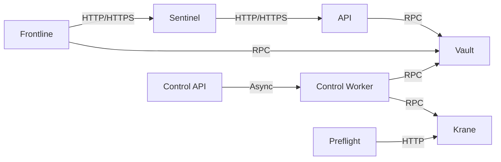
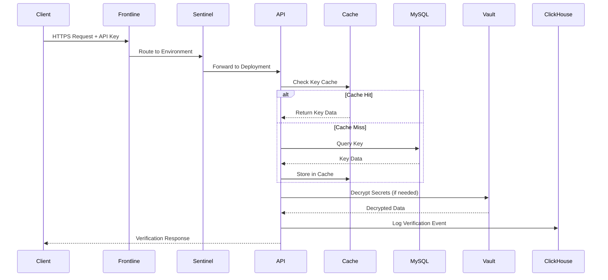
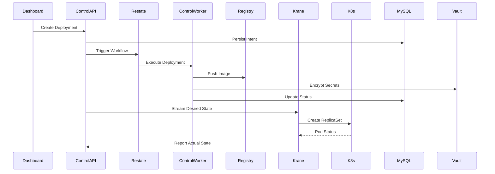

Unkey is built as a distributed, polyglot system designed for global deployment with high availability and low latency. The platform separates control plane operations from data plane execution, enabling independent scaling and regional deployment.

## System Overview

Unkey's architecture consists of multiple specialized services that work together to provide API authentication, authorization, and management capabilities:

## Core Services

<CardGroup cols={2}>
  <Card title="API" icon="code" href="#api-service">
    Primary RPC-style HTTP API for key verification and management
  </Card>
  <Card title="Frontline" icon="shield" href="#frontline">
    Multi-tenant ingress for TLS termination and routing
  </Card>
  <Card title="Sentinel" icon="radar" href="#sentinel">
    Per-environment gateway for routing and middleware policies
  </Card>
  <Card title="Vault" icon="lock" href="#vault">
    Centralized encryption service for key material management
  </Card>
  <Card title="Control Plane" icon="sliders" href="#control-plane">
    Deployment orchestration and workflow management
  </Card>
  <Card title="Krane" icon="ship" href="#krane">
    Kubernetes control agent for resource reconciliation
  </Card>
</CardGroup>

### API Service

The API service is the primary interface for users to interact with Unkey. It exposes an authenticated RPC-style HTTP API for all CRUD operations on keys, APIs, identities, and permissions.

**Key responsibilities:**
- Key verification and authentication
- Rate limiting and usage tracking
- Key and API management operations
- Audit logging for security events
- Analytics event collection

**Request handling pipeline:**
1. Panic recovery and tracing
2. ClickHouse request metrics
3. Structured logging with request IDs
4. Error translation using fault codes
5. One-minute timeout enforcement
6. Request validation

**Data dependencies:**
- **MySQL**: Control plane data (keys, APIs, identities, permissions)
- **Redis**: Rate limiting counters and cache
- **ClickHouse**: Verification events and analytics (optional)
- **Vault**: Encryption and secret handling via RPC
- **Control API**: Deployment operations via RPC

**Ports:**
- `7070`: HTTP API
- `2112`: Prometheus metrics
- `7946/7947`: Gossip cluster (TCP/UDP)

<Note>
  ClickHouse is optional. When not configured, analytics writes become no-ops.
</Note>

### Frontline

Frontline is the multi-tenant ingress service that sits at the edge of the network. It terminates TLS connections, performs SNI routing, and forwards requests to the appropriate per-environment sentinel.

**Key responsibilities:**
- TLS termination with dynamic certificate selection
- SNI-based routing to environments
- Cross-region request forwarding
- Certificate and routing caching

**Architecture:**
- First Unkey-owned hop for inbound traffic
- Reads routing data from MySQL control plane
- Maintains short-lived caches to avoid database round trips
- Handles failover when regions are unavailable

**Data dependencies:**
- **MySQL**: Environment routing and certificate data
- **Vault**: Certificate retrieval via RPC

**Ports:**
- `7070`: HTTP
- `7443`: HTTPS
- `9090`: Prometheus metrics

### Sentinel

Sentinel is the per-environment gateway that routes requests from Frontline to specific deployments and enforces middleware policies before requests reach user workloads.

**Key responsibilities:**
- Resolve deployment IDs to running instances
- Evaluate middleware policies (KeyAuth, rate limiting)
- Forward requests to selected instances
- Record request telemetry

**Architecture:**
- One sentinel per environment
- Uses deployment ID header (`X-Deployment-Id`) for routing
- Filters instances by region and status
- Caches deployment and instance data with stale-while-revalidate
- Gossip-based cache invalidation across sentinel nodes

**Data dependencies:**
- **MySQL**: Deployment and instance data
- **ClickHouse**: Request telemetry (optional)

**Ports:**
- `8080`: HTTP gateway
- `9090`: Prometheus metrics

### Vault

Vault is Unkey's centralized encryption service that manages data encryption keys (DEKs) and enables runtime services to encrypt/decrypt sensitive payloads without embedding key material in application code.

**Key responsibilities:**
- Issue and store DEKs per keyring
- Encrypt and decrypt payloads with DEKs
- Validate encrypted payload structure
- Re-encrypt payloads during key rotation

**Key model:**
- **KEK (Key Encryption Key)**: Master key for encrypting DEKs
- **DEK (Data Encryption Key)**: Per-keyring data key for payload encryption
- Uses AES-256-GCM encryption

**RPC methods:**
- `Liveness`: Health check endpoint
- `Encrypt`: Encrypt payloads with latest DEK
- `Decrypt`: Validate and decrypt payloads
- `ReEncrypt`: Rotate to latest DEK

**Storage:**
- Encrypted DEKs stored in S3-compatible object storage
- Object path: `keyring/<ring_id>/<dek_id>`
- `LATEST` pointer tracks newest DEK per keyring

**Caching:**
- In-memory cache with 1-hour freshness
- 24-hour stale tolerance
- Up to 10,000 DEKs per instance

**Data dependencies:**
- **S3-compatible storage**: DEK persistence

**Ports:**
- `8060`: HTTP RPC endpoint

### Control Plane

The control plane consists of two components: the Control API and Control Worker. Together they manage deployment intent, orchestration workflows, and background maintenance.

#### Control API

**Key responsibilities:**
- System of record for deployment intent
- Accept changes from dashboard and automation
- Persist configuration in MySQL
- Trigger worker workflows for async operations

**Data dependencies:**
- **MySQL**: Deployment configuration and state
- **Restate**: Workflow orchestration
- **GitHub**: App integration for CI/CD

**Ports:**
- `8080`: HTTP API
- `9090`: Prometheus metrics

#### Control Worker

**Key responsibilities:**
- Execute deployment workflows
- Manage TLS certificates via ACME
- Assign and update routes
- Background maintenance jobs (quota checks, key refills)

**Workflows:**
- Deployment creation and updates
- Certificate issuance and renewal
- Custom domain provisioning
- GitHub App integration

**Data dependencies:**
- **MySQL**: Deployment state
- **ClickHouse**: Analytics data
- **Vault**: Secret handling via RPC
- **Container Registry**: Image push/pull
- **Route53**: DNS and ACME challenges

**Ports:**
- `9080`: Restate ingress
- `9090`: Prometheus metrics

### Krane

Krane is Unkey's in-cluster Kubernetes control agent that reconciles control plane intent into Kubernetes resources and reports actual state upstream.

**Key responsibilities:**
- Reconcile user workloads as ReplicaSets
- Reconcile sentinel infrastructure (Deployments, Services, PDBs)
- Manage Cilium network policies
- Report deployment and sentinel status
- Decrypt workload secrets via Vault

**Control loops:**
1. **Deployment controller**: Manages user workload ReplicaSets
2. **Sentinel controller**: Manages routing infrastructure
3. **Cilium controller**: Manages network policies
4. **Resync loop**: Corrects drift every minute

**Architecture:**
- Uses server-side apply for all resources
- Streaming desired state from control plane
- Kubernetes watches for actual state
- Labels all managed resources with `app.kubernetes.io/managed-by=krane`

**Pod isolation:**
- Runs workloads with `RuntimeClassName: gvisor`
- Tolerates `karpenter.sh/nodepool=untrusted` taint
- Topology spread across availability zones

**Data dependencies:**
- **Control API**: Deployment intent stream
- **Vault**: Secret decryption via RPC
- **Kubernetes API**: Resource management

**Ports:**
- `8080`: HTTP API
- `9090`: Prometheus metrics

### Preflight

Preflight is the Kubernetes admission webhook that enforces platform requirements during pod creation, keeping workload manifests minimal while ensuring proper secret handling and registry access.

**Key responsibilities:**
- Inject init container and secrets wiring
- Rewrite container entrypoints to use inject binary
- Add registry pull secrets for private images
- Clean up expired pull secrets

**Admission flow:**
1. API server calls `/mutate` webhook
2. Preflight checks for `unkey.com/deployment.id` label
3. Returns JSON patch to inject secrets infrastructure
4. Mutated pod runs with proper credentials

**Registry support:**
- On-demand Depot tokens for `registry.depot.dev`
- Registry aliases for hostname rewriting
- Kubernetes keychain integration

**Ports:**
- `443`: Service port (maps to `8443` container)

## Data Flow Patterns

### Key Verification Flow

### Deployment Creation Flow

## Cache Invalidation

Unkey uses gossip-based cache invalidation to maintain consistency across distributed service instances:

- **API Service**: Key, API, and rate limit namespace caches
- **Sentinel**: Deployment and instance route caches
- **Frontline**: Certificate and environment route caches

**Gossip protocol:**
- Nodes subscribe to invalidation messages
- Cache changes broadcast to cluster
- Uses ordering mechanism (timestamps/Lamport clocks)
- Falls back to local-only invalidation on gossip failure

**Cache strategies:**
- **Stale-While-Revalidate (SWR)**: Serve stale data while refreshing
- **TTL-based**: Expire after time threshold
- **Event-based**: Invalidate on mutation events

## Technology Stack

<AccordionGroup>
  <Accordion title="Backend Services">
    - **Language**: Go 1.25+
    - **Build System**: Bazel
    - **RPC Framework**: Connect RPC (gRPC-compatible)
    - **Protocol**: Protocol Buffers v3
    - **HTTP Framework**: Chi router
    - **Tracing**: OpenTelemetry
  </Accordion>

  <Accordion title="Data Stores">
    - **Primary Database**: MySQL 8.0+
    - **Cache & Rate Limiting**: Redis 8.0+ (or Dragonfly)
    - **Analytics**: ClickHouse 23.0+
    - **Object Storage**: S3-compatible (MinIO, AWS S3)
    - **Workflow Engine**: Restate
  </Accordion>

  <Accordion title="Infrastructure">
    - **Container Runtime**: Docker / containerd
    - **Orchestration**: Kubernetes 1.28+
    - **Isolation**: gVisor (RuntimeClassName)
    - **Networking**: Cilium CNI with network policies
    - **Node Provisioning**: Karpenter
    - **Service Mesh**: Native Kubernetes Services
  </Accordion>

  <Accordion title="Observability">
    - **Metrics**: Prometheus with Grafana
    - **Tracing**: OpenTelemetry to OTLP endpoint
    - **Logs**: Structured JSON with request IDs
    - **Profiling**: pprof endpoints (authenticated)
    - **Alerting**: Alertmanager with incident.io integration
  </Accordion>

  <Accordion title="Security">
    - **Encryption**: AES-256-GCM for data at rest
    - **TLS**: Automatic certificate management via cert-manager
    - **ACME**: Let's Encrypt with Route53 DNS validation
    - **Secrets**: External Secrets Operator with AWS Secrets Manager
    - **Network Policies**: Cilium L3/L4/L7 policies
  </Accordion>
</AccordionGroup>

## High Availability Design

Unkey's architecture is designed for high availability through several mechanisms:

### Stateless Services

All core services (API, Frontline, Sentinel) are stateless and can scale horizontally:
- Multiple replicas per service
- Load balanced across availability zones
- No shared local state between instances
- Graceful shutdown with connection draining

### Data Layer Redundancy

- **MySQL**: Primary/replica configuration with automatic failover
- **Redis**: Sentinel mode or cluster for HA
- **ClickHouse**: Replicated tables across shards
- **S3**: Cross-region replication for vault storage

### Regional Isolation

- Services deployed in multiple geographic regions
- Frontline routes to nearest available region
- Regional failure triggers automatic cross-region routing
- Each region operates independently

### Circuit Breakers

All service-to-service communication includes:
- Timeout enforcement (default 1 minute)
- Retry with exponential backoff
- Circuit breaker patterns for failing dependencies
- Graceful degradation when optional services unavailable

## Deployment Architecture

Unkey supports multiple deployment models:

### Unkey-Managed Cloud

- Fully managed by Unkey team
- Multi-tenant infrastructure
- Global edge deployment
- Automated scaling and updates

### Customer-Managed (Self-Hosted)

- Deploy in your own infrastructure
- Full control over data and resources
- Kubernetes-based deployment
- Helm charts provided

See [Deployments](/platform/deployments) for regional availability and [Self-Hosting](/platform/self-hosting) for setup instructions.

## Performance Characteristics

<CardGroup cols={2}>
  <Card title="API Latency" icon="gauge-high">
    **P50**: &lt;10ms  
    **P99**: &lt;50ms  
    Measured from edge to response
  </Card>
  <Card title="Throughput" icon="chart-line">
    **Per Instance**: 10,000+ req/s  
    **Horizontally Scalable**: Add replicas for capacity
  </Card>
  <Card title="Cache Hit Rate" icon="bullseye">
    **Key Verification**: >95%  
    **Route Resolution**: >99%  
    With proper TTL configuration
  </Card>
  <Card title="Availability" icon="shield-check">
    **Data Plane**: 99.99%  
    **Control Plane**: 99.9%  
    Independent availability zones
  </Card>
</CardGroup>

## Related Documentation

- [Deployments](/platform/deployments) - Regional deployment model and infrastructure
- [Self-Hosting](/platform/self-hosting) - Run Unkey in your own environment
- [Configuration Reference](/platform/self-hosting#configuration) - Service configuration options