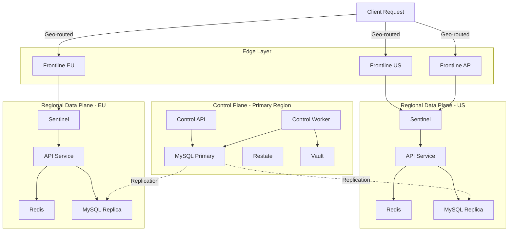
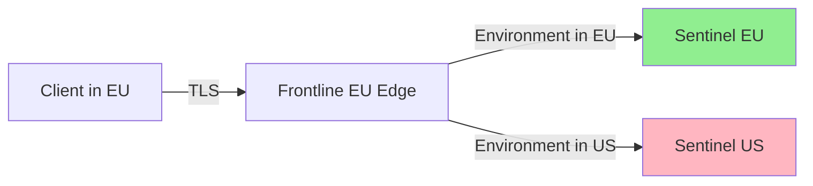

Unkey is deployed globally across multiple regions to provide low-latency access to API verification and management operations. The platform uses a distributed architecture that separates control plane operations from data plane execution.

## Deployment Model

Unkey operates on a multi-region, edge-optimized deployment model:



### Architecture Layers

<CardGroup cols={3}>
  <Card title="Edge Layer" icon="globe">
    **Frontline** services deployed globally for TLS termination and intelligent routing to regional data planes
  </Card>
  <Card title="Regional Data Plane" icon="server">
    **Sentinel** and **API** services with regional databases and caches for fast key verification
  </Card>
  <Card title="Control Plane" icon="sliders">
    Centralized **Control API** and **Worker** for deployment orchestration and management
  </Card>
</CardGroup>

## Regional Availability

### Unkey Cloud Regions

Unkey Cloud is deployed in the following regions:

<Tabs>
  <Tab title="Production">
    | Region | Location | Services | Primary |
    |--------|----------|----------|----------|
    | `us-east-1` | US East (Virginia) | Full Stack | ✓ |
    | `us-west-2` | US West (Oregon) | Data Plane | |
    | `eu-west-1` | Europe (Ireland) | Data Plane | |
    | `ap-southeast-1` | Asia Pacific (Singapore) | Data Plane | |
    | `ap-northeast-1` | Asia Pacific (Tokyo) | Data Plane | |

    **Full Stack**: Control Plane + Data Plane  
    **Data Plane**: API, Sentinel, Frontline, Regional Cache/DB
  </Tab>

  <Tab title="Edge Points of Presence">
    Frontline services are deployed to edge locations for optimal TLS termination:

    - **Americas**: 12 locations (US, Canada, Brazil)
    - **Europe**: 18 locations (UK, Germany, France, Netherlands, etc.)
    - **Asia Pacific**: 8 locations (Singapore, Tokyo, Sydney, India)
    - **Middle East & Africa**: 4 locations

    <Note>
      Edge routing automatically directs requests to the nearest Frontline instance based on client geography.
    </Note>
  </Tab>
</Tabs>

### Service Distribution

<AccordionGroup>
  <Accordion title="Primary Region (us-east-1)">
    The primary region hosts the complete Unkey stack:

    **Control Plane:**
    - Control API (deployment management)
    - Control Worker (orchestration workflows)
    - MySQL Primary (source of truth)
    - Restate (workflow engine)
    - Vault (encryption service)

    **Data Plane:**
    - API Service (key verification)
    - Sentinel (environment gateway)
    - Frontline (edge ingress)
    - Redis (cache and rate limiting)
    - MySQL Replica (regional reads)
    - ClickHouse (analytics)
  </Accordion>

  <Accordion title="Secondary Regions">
    Secondary regions host data plane services for low-latency verification:

    **Deployed Services:**
    - API Service
    - Sentinel
    - Frontline
    - Redis (regional instance)
    - MySQL Replica (read replica from primary)

    **Not Deployed:**
    - Control API (centralized in primary)
    - Control Worker (centralized in primary)
    - Vault (accessed via RPC from primary)
    - Restate (centralized in primary)

    <Note>
      Secondary regions can verify keys and enforce rate limits independently, even if the primary region is unavailable.
    </Note>
  </Accordion>

  <Accordion title="Edge Locations">
    Edge locations run lightweight Frontline instances:

    **Responsibilities:**
    - TLS termination
    - SNI-based routing
    - Certificate caching
    - Geo-routing to nearest data plane

    **No Data Persistence:**
    - All edge instances are stateless
    - Route decisions cached in-memory
    - Automatic failover to alternate regions
  </Accordion>
</AccordionGroup>

## Routing and Traffic Flow

### Request Path

1. **DNS Resolution**: Client resolves `api.unkey.com` to nearest edge location via GeoDNS
2. **Edge Termination**: Frontline terminates TLS and reads SNI hostname
3. **Environment Routing**: Frontline queries routing table and selects target Sentinel
4. **Regional Gateway**: Sentinel resolves deployment ID and forwards to API instance
5. **Key Verification**: API service processes request with regional cache/database
6. **Response**: Response flows back through Sentinel → Frontline → Client

<Note>
  The entire request path from edge to API service typically completes in **&lt;10ms at P50** and **&lt;50ms at P99**.
</Note>

### Cross-Region Routing

Frontline automatically routes requests across regions when necessary:



**Routing Logic:**
- Prefers same-region routing when environment exists in client region
- Falls back to cross-region when environment only exists in different region
- Retries alternate regions on failure (circuit breaker)
- Caches routing decisions to avoid database lookups

### Regional Failover

Unkey implements automatic regional failover:

1. **Health Monitoring**: Continuous health checks on all regional services
2. **Circuit Breaking**: Failing regions marked unhealthy after threshold
3. **Automatic Rerouting**: Frontline redirects traffic to healthy regions
4. **Gradual Recovery**: Failed regions gradually receive traffic after recovery

<Warning>
  During regional failover, cross-region requests may experience higher latency (typically +50-100ms) but remain functional.
</Warning>

## Latency Characteristics

### Typical Latencies by Region

<Tabs>
  <Tab title="Same-Region">
    When client and data plane are in the same region:

    | Operation | P50 | P95 | P99 |
    |-----------|-----|-----|-----|
    | Key Verification (cached) | 5ms | 15ms | 30ms |
    | Key Verification (uncached) | 12ms | 25ms | 45ms |
    | Rate Limit Check | 8ms | 18ms | 35ms |
    | Key Creation | 25ms | 50ms | 80ms |
    | Key Lookup | 10ms | 22ms | 40ms |
  </Tab>

  <Tab title="Cross-Region">
    When request must route to different region:

    | Route | Additional Latency |
    |-------|--------------------|
    | US East → US West | +20-30ms |
    | US → Europe | +50-80ms |
    | US → Asia | +100-150ms |
    | Europe → Asia | +80-120ms |

    <Note>
      Cross-region latency is primarily network transit time. Service processing time remains constant.
    </Note>
  </Tab>

  <Tab title="Cache Impact">
    Cache hit rates significantly impact latency:

    | Cache Type | Hit Rate | Latency Reduction |
    |------------|----------|-------------------|
    | Key Cache | >95% | -7ms average |
    | Route Cache | >99% | -15ms average |
    | API Metadata | >90% | -5ms average |

    **Cache Configuration:**
    - Key cache: 1-hour TTL with SWR
    - Route cache: 10-minute TTL with gossip invalidation
    - API metadata: 5-minute TTL
  </Tab>
</Tabs>

### Latency Optimization Strategies

<CardGroup cols={2}>
  <Card title="Regional Deployment" icon="map-location-dot">
    Deploy your application in the same region as Unkey data plane for minimal latency
  </Card>
  <Card title="Cache Warming" icon="fire">
    Pre-warm caches during deployment to avoid cold start penalties
  </Card>
  <Card title="Connection Pooling" icon="layer-group">
    Maintain persistent HTTP/2 connections to avoid TLS handshake overhead
  </Card>
  <Card title="Batch Operations" icon="boxes-stacked">
    Use batch verification endpoints when verifying multiple keys
  </Card>
</CardGroup>

## Infrastructure Components

### Compute

**Kubernetes Clusters:**
- EKS (Elastic Kubernetes Service) in AWS regions
- Node pools with Karpenter autoscaling
- gVisor runtime for workload isolation
- Multi-zone distribution for high availability

**Service Sizing:**

| Service | CPU per Pod | Memory per Pod | Min Replicas | Max Replicas |
|---------|-------------|----------------|--------------|-------------|
| API | 1000m | 1Gi | 3 | 50 |
| Frontline | 500m | 512Mi | 3 | 30 |
| Sentinel | 500m | 512Mi | 2 | 20 |
| Control API | 1000m | 1Gi | 2 | 10 |
| Vault | 500m | 512Mi | 2 | 10 |
| Krane | 250m | 256Mi | 1 | 3 |

### Database Infrastructure

**MySQL:**
- RDS Multi-AZ deployment in primary region
- Read replicas in each secondary region
- Automated backups with point-in-time recovery
- Connection pooling via ProxySQL

**Redis:**
- Dragonfly or Redis in cluster mode
- Regional instances per data plane
- Persistence disabled (cache and ephemeral counters only)
- Automatic failover with Sentinel

**ClickHouse:**
- Replicated tables across shards
- Separate instance per region (optional)
- 90-day retention for analytics events
- Asynchronous writes (fire-and-forget)

### Network Architecture

**Load Balancing:**
- AWS Network Load Balancer (NLB) for Frontline
- Internal Kubernetes Services for inter-service communication
- Cilium CNI for network policies

**DNS Configuration:**
- Route53 GeoDNS for regional routing
- Health-check based failover
- Automatic TLS certificate provisioning via cert-manager

**Security:**
- TLS 1.3 for all external connections
- mTLS between services (optional)
- Cilium network policies for pod-to-pod traffic
- AWS Security Groups for infrastructure isolation

### Storage

**Object Storage (Vault):**
- S3 buckets in primary region
- Optional cross-region replication
- Versioning enabled for key recovery
- Lifecycle policies for old key rotation

**Persistent Volumes:**
- EBS volumes for database storage
- Snapshots for backup/restore
- Encryption at rest with KMS

## Monitoring and Observability

### Metrics Collection

All services expose Prometheus metrics:

- **Request Metrics**: Latency histograms, error rates, throughput
- **System Metrics**: CPU, memory, network I/O
- **Business Metrics**: Key verifications, rate limit hits, cache hit rates
- **Deployment Metrics**: Pod count, rollout status, health checks

**Retention**: 90 days in Prometheus, 1 year in long-term storage (Thanos/Mimir)

### Distributed Tracing

OpenTelemetry traces span the entire request path:

```
Client Request
  → Frontline (span: tls_termination, routing)
    → Sentinel (span: deployment_lookup, middleware)
      → API (span: key_verification, rate_limit, audit_log)
        → Vault (span: decrypt)
        → MySQL (span: query)
        → Redis (span: cache_get)
      → ClickHouse (span: analytics_write)
```

**Sampling**: 1% of production traffic, 100% of errors

### Health Checks

All services expose standard health endpoints:

- `/health/live`: Liveness probe (process alive)
- `/health/ready`: Readiness probe (ready to serve traffic)
- `/health/startup`: Startup probe (initialization complete)

**Kubernetes Configuration:**
- Liveness: 30s timeout, 3 failures = restart
- Readiness: 10s timeout, 3 failures = remove from service
- Startup: 60s timeout, 10 failures = mark unhealthy

## Disaster Recovery

### Backup Strategy

**MySQL Backups:**
- Automated daily snapshots retained for 30 days
- Transaction logs for point-in-time recovery
- Cross-region backup replication
- 4-hour RPO (Recovery Point Objective)

**ClickHouse Backups:**
- Weekly full backups
- Daily incremental backups
- 90-day retention
- Asynchronous, analytics loss acceptable

**Vault Key Backups:**
- S3 versioning enabled
- Cross-region replication
- Encrypted with separate KMS key
- Immutable backup mode (WORM)

### Recovery Procedures

<Accordion title="Regional Failure">
  1. Automatic failover triggers within 60 seconds
  2. Frontline redirects traffic to healthy regions
  3. API services serve from read replicas
  4. Degraded mode: Read-only operations continue
  5. Write operations queued or rejected (depending on configuration)
  6. Recovery: Restore region, replay transaction logs, resume normal operation

  **RTO (Recovery Time Objective)**: 15 minutes for data plane, 1 hour for control plane
</Accordion>

<Accordion title="Database Failure">
  1. RDS automatic failover to standby (Multi-AZ)
  2. Application connection retry with backoff
  3. Read replicas promoted if primary unavailable
  4. Point-in-time restore from backup if corruption detected

  **RTO**: 5 minutes for automatic failover, 2 hours for restore from backup
</Accordion>

<Accordion title="Complete Region Loss">
  1. Manual intervention to verify scope
  2. Promote read replica in alternate region to primary
  3. Update DNS to redirect all traffic
  4. Scale up alternate region capacity
  5. Rebuild failed region from backups

  **RTO**: 2-4 hours for full recovery
</Accordion>

## Scaling Characteristics

### Horizontal Scaling

**Automatic Scaling Triggers:**

| Service | Scale Up Threshold | Scale Down Threshold |
|---------|-------------------|----------------------|
| API | CPU &gt;70% or RPS &gt;8k | CPU &lt;30% and RPS &lt;2k |
| Sentinel | CPU &gt;60% or Connections &gt;5k | CPU &lt;20% |
| Frontline | CPU &gt;60% | CPU &lt;20% |

**Scaling Behavior:**
- Scale-up: Add 50% more replicas (min +1, max +10 per event)
- Scale-down: Remove 25% of replicas (max -2 per event)
- Cooldown: 3 minutes between scale events
- Pod disruption budgets prevent scaling during deployments

### Vertical Scaling

Services use Vertical Pod Autoscaler (VPA) in recommendation mode:

- VPA monitors resource usage over 7 days
- Recommends CPU/memory adjustments
- Manual review and apply during maintenance window
- Typically adjusted quarterly

### Capacity Planning

Current capacity per region:

- **Peak RPS**: 100,000+ requests per second
- **Key Verifications**: 50M+ per minute
- **Concurrent Connections**: 500,000+
- **API Keys**: 10M+ active keys

<Note>
  Capacity planning is based on p95 latency targets. Burst capacity allows 2x peak load for short periods.
</Note>

## Cost Optimization

Unkey's deployment model optimizes for cost efficiency:

1. **Regional Caching**: Reduce database load by 95%+ with aggressive caching
2. **Spot Instances**: Use spot nodes for non-critical workloads (30-50% cost savings)
3. **Autoscaling**: Scale down during off-peak hours
4. **Storage Tiering**: Move old analytics to cold storage (S3 Glacier)
5. **Compression**: Enable compression for ClickHouse and object storage

## Self-Hosted Deployments

For self-hosted deployments, you can choose your deployment model:

- **Single Region**: Simplest setup, lower cost, higher latency for distant users
- **Multi-Region Data Plane**: Deploy API services in multiple regions with primary control plane
- **Full Multi-Region**: Replicate entire stack across regions for maximum availability

See [Self-Hosting Guide](/platform/self-hosting) for detailed setup instructions.

## Related Documentation

- [Architecture Overview](/platform/architecture) - System architecture and service details
- [Self-Hosting Guide](/platform/self-hosting) - Run Unkey in your environment
- [Configuration Reference](/platform/self-hosting#configuration) - Service configuration options